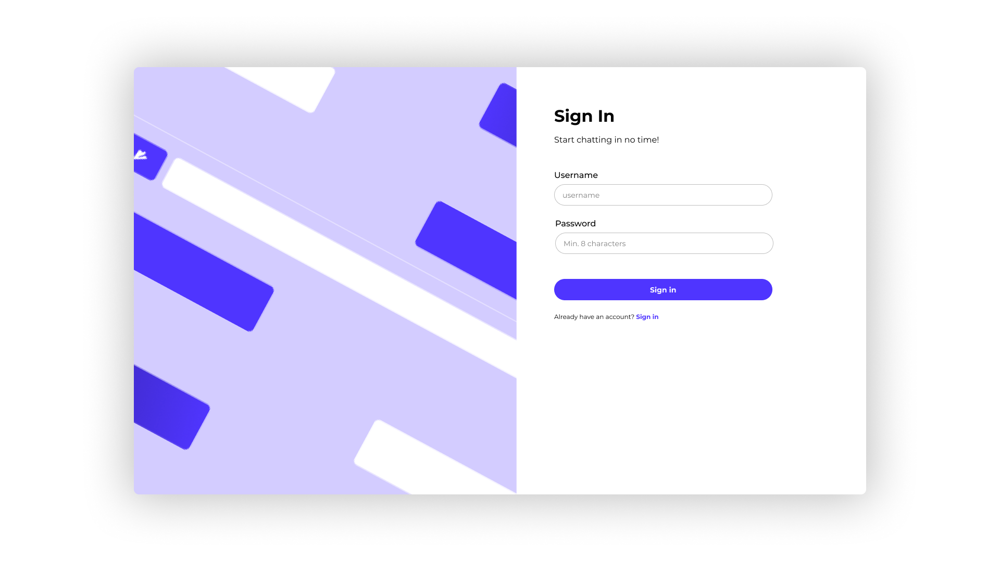

# API

## Week 1

### Concept

Mijn eerste concept was om een mini super-app (Web app) te maken. Een website die meerdere functionaliteiten in een heeft die met elkaar communiceren. Deze zou bestaan uit een chat, een ticket/event & soort van netflix clone. Toen ik dit besprak met Cyd, kwamen we erachter dat dit niet erg realistisch is om te halen binnen de tijd die we voor dit vak hadden, dus besloot ik om een chat website te maken.

### Design

Ik begon met het maken van een design voor de website, zodat ik een duidelijk zicht had van wat ik allemaal ging maken.
Hier zijn een aantal afbeeldingen van mijn design:

_Design Register Page_

_Design Login Page_

_Design Home Page_

_Design Chat Page (Mobile)_

_Design Chat Page (Desktop)_

### Database Setup

Daarna heb ik een MongoDB database opgezet met 4 collections:

- chats
- groups (Deze heb ik uiteindelijk niet gebruikt)
- messages
- users

_Database Chat Structure_

_Database Message Structure_

Dit is hoe de chat en message fields eruit zien.
De user fields bestaan uit:

- id
- username
- name
- email
- password
- profilePic
- status
- lastSeen
- bio

### Feedback

Tijdens het eerste feedback gesprek kreeg ik te horen dat inloggen en uitloggen beter gefaked moeten worden, omdat Cyd het niet heel interessant vond, maar ik heb besloten om alles wel echt werkend te maken. Ook zodat alle chats echt opgeslagen kunnen worden. Voor de rest was mijn concept goed en kon ik aan de slag gaan met het maken van de website.

## Week 2

### Register/Login

In Week 2 heb ik het registreren en inloggen werkend gemaakt. Hier was ik aan het einde van vorige week mee begonnen en heb ik begin van deze week af kunnen maken. Het duurde iets langer dan gehoopt, omdat tinyHTTP iets anders werkt dan Express of Sveltekit, waar ik eerder mee heb gewerkt.

### Homepage

Daarna ben ik bezig geweest met het maken van de homepage. Ik had zelf in de database wat test data ingevoerd, zodat ik deze alvast kon ophalen en ik heb gezorgd dat de chats te zien zijn, met het nieuwste bericht die is gestuurd. Ook worden de chats gesorteerd op basis van het nieuwste bericht. Daarnaast had ik alvast de UI gemaakt voor de buttons om naar je profiel te gaan of een chat aan te maken.

### Chat page UI

Daarna ben ik aan de slag gegaan met de UI van de chat page. Hiervoor gebruikte ik nog de test data die ik had gemaakt om zo tenminste de berichten te kunnen stijlen. Ook heb ik de input gestijld en alvast gezorgd dat de input aanpast aan de hand van de inhoud.

_Empty input_

_Input not empty_

### Feedback

Het feedback gesprek was erg positief, omdat ik al best ver was met de website (De feedback sessie vond plaats aan het begin van week 3, dus ik kon ook al chats versturen). En ik was samen met Declan gegaan door functionaliteiten die de priotiteit hebben om uit te werken en die haalbaar zijn.

## Week 3

### Chats (Sending messages)

Ik heb hier de chats werkend gemaakt, dus het versturen/ontvangen van een bericht. Ik heb hierbij ook voor het eerst server sent events gebruikt, om te zorgen dat de chat ook binnenkomt zonder te refreshen. Dit werkt redelijk goed, alleen nog niet op alle browsers. Dit is iets waar ik zeker nog aan zal werken na het project om te zorgen dat de chat compleet Real-time is. Toen ik eenmaal deze functionaliteit af had, was ik wel erg blij dat de hoofdfunctionaliteit in ieder geval werkte.

### Profile page

Ook heb ik een profiel pagina gemaakt. Deze is niet heel bijzonder, maar het is wel een leuke extra.

### View transitions

Daarnaast ben ik aan de slag gegaan met View-transitions. Ik heb hier best een tijdje aangezeten met Cyd, omdat wat ik wou bereiken toch iets lastiger was dan een simpele view-transition.

Uitendelijk heeft Cyd mij deze artikelen gestuurd, maar ik heb geen tijd meer gehad om dit uit te proberen. Er zitten dus wel view-transitions in, maar nog niet helemaal hoe ik het zou willen. Ook dit is iets om naar te kijken als dit project afgelopen is.

- https://css-tricks.com/what-on-earth-is-the-types-descriptor-in-view-transitions/
- https://developer.chrome.com/docs/web-platform/view-transitions/cross-document#view-transition-types

### Feedback

Dit was het laatste feedback gesprek en opzich waren de meeste functionaliteiten wel positief, alleen redirect ik op een groot scherm naar de nieuwste chat en ik kreeg te horen dat ik beter de homepage moet behouden en daarop gewoon de nieuwste chat als eerste moet inladen. Vanwege weinig tijd heb ik dit niet meer kunnen aanpassen (Dit gesprek vond plaats op dinsdag in week 4), omdat ik dan best wat moest aanpassen. Wel wil ik kijken naar een andere manier van data inladen ipv parameters. Ik zag bij de web versie van [whatsapp](https://web.whatsapp.com) dat alle chats gewoon op de homepagina worden geladen. De URL veranderd dus niet.

## Week 4

### Responsiveness

In week 4 ben ik bezig geweest met responsiveness. Eerst had ik de website gemaakt voor mobiel, maar de layout veranderd best wel op desktop dus dit duurde wel een tijdje, maar uiteindelijk heb ik dus een automatische redirect naar de eerste chat en daar is de nieuwe layout dan, met alle chats aan de linkerkant en de huidige chat aan de rechterkant.

### Speech-to-text

Ik heb ook een functie voor speech to text toegevoegd. Het liefst zou ik voice memo's willen toevoegen, maar ik zag dat dit ook iets lastiger is om op te slaan en op te halen met de database. Deze zouden dan het liefst in Amazon S3 opgeslagen moeten worden met een referentie in de database en dat wordt al iets complexer. Al helemaal voor de tijd die ik nog over had.

### Make new chat

Ook heb ik nog de functie gemaakt om een nieuwe chat te maken. Nu kan er een nieuwe chat gestart worden met alle users die de chat heeft. Iets wat ik nog moet verbeteren is dat je momenteel ook een chat kan maken met iemand waarmee je al een chat hebt. Graag zou ik deze functionaliteit ook uitbreiden om chat groepen te kunnen maken.

### User status

Tenslotte heb ik de user status werkend en Real-time kunnen maken. Op het moment dat een tab actief is dan is de status online, als de tab niet actief is dan is de status offline & als de tab actief is maar er geen muis beweegt voor 1 minuut, dan is de status away. Ook hierbij heb ik gebruik gemaakt van server sent events.

## Wat zou ik doen als ik meer tijd had?

Als ik meer tijd had zou ik graag deze features nog toegevoegd hebben:

- Locatie delen
- Push notifications
- Gelezen/Gestuurde berichten checken (Intersection observer)
- Indicatie als iemand aan het typen is (is typing...)
- Foto’s kunnen maken/bijvoegen
- Groepen maken
- Reply op een bericht
- Voice/Video call

## Slotwoord

Ik vond dit een erg leuk en uitdagend vak waar ik veel heb geleerd. Aan het begin van dit vak zou ik niet denken dat ik een chat website zou kunnen maken, maar dit is toch gelukt en daar ben ik erg tevreden mee en trots op. Ook vond ik het leuk dat dit vak heel vrij was qua concept, waardoor iedereen een unieke website heeft kunnen maken.
